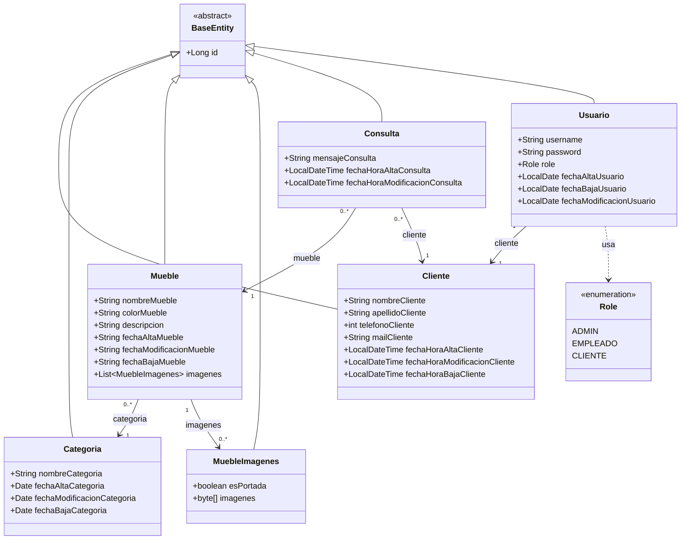

# Diagrama de clases — modelo de dominio (Entities)

Generado a partir de `src/main/java/com/Capinteria/carpinteria/Entity/` y `.../enumeration/`. Solo el modelo de dominio persistido (JPA) — no incluye Controllers, Services, Repositories ni DTOs.

Refleja el refactor "SolicitarVisita → Consulta" (el cliente consulta por un mueble puntual del catálogo, ya no "solicita una visita") y la simplificación de `Mueble` (sin `dimension`/`precio`/`tipoMadera`: son muebles a medida) y `Cliente` (sin `estadoCliente`: el cliente ya no maneja estados).



## Notas sobre las relaciones

- Todas las entidades heredan `id` (`Long`, autoincremental) de `BaseEntity` (`@MappedSuperclass`, no es una tabla propia).
- **Mueble → Categoria**: `@ManyToOne` (FK `categoria_id` en `mueble`).
- **Mueble → MuebleImagenes**: `@OneToMany` unidireccional (FK `mueble_id` en `mueble_imagenes`).
- **Consulta → Mueble** y **Consulta → Cliente**: ambas `@ManyToOne`, obligatorias (`nullable = false`). Cada consulta es siempre sobre un mueble puntual y de un cliente identificado — ya no existen consultas "generales" sin mueble.
- **Usuario → Cliente**: `@OneToOne` (FK `cliente_id`, único).

## Qué cambió respecto a la versión anterior

- `SolicitarVisita` → **`Consulta`** (tabla `solitar_visita` → `consulta`). Ya no admite mueble nulo; `consultaSolicitarVisita` pasó a llamarse `mensajeConsulta`; se eliminó `fechaHoraBajaConsulta` (una consulta no se da de baja).
- `Mueble` perdió `dimension`, `precio` y `tipoMadera` (son muebles a medida: varían por pedido).
- `Cliente` perdió `estadoCliente` (ya no hay gestión de estado del cliente).
- Se eliminaron los enums `TipoMadera` y `EstadoCliente` por completo.

## Cómo ver el diagrama

- GitHub/GitLab renderizan los bloques ` ```mermaid ` automáticamente al ver este archivo en el repo.
- En VS Code, instalando la extensión "Markdown Preview Mermaid Support", `Ctrl+Shift+V` sobre este archivo.
